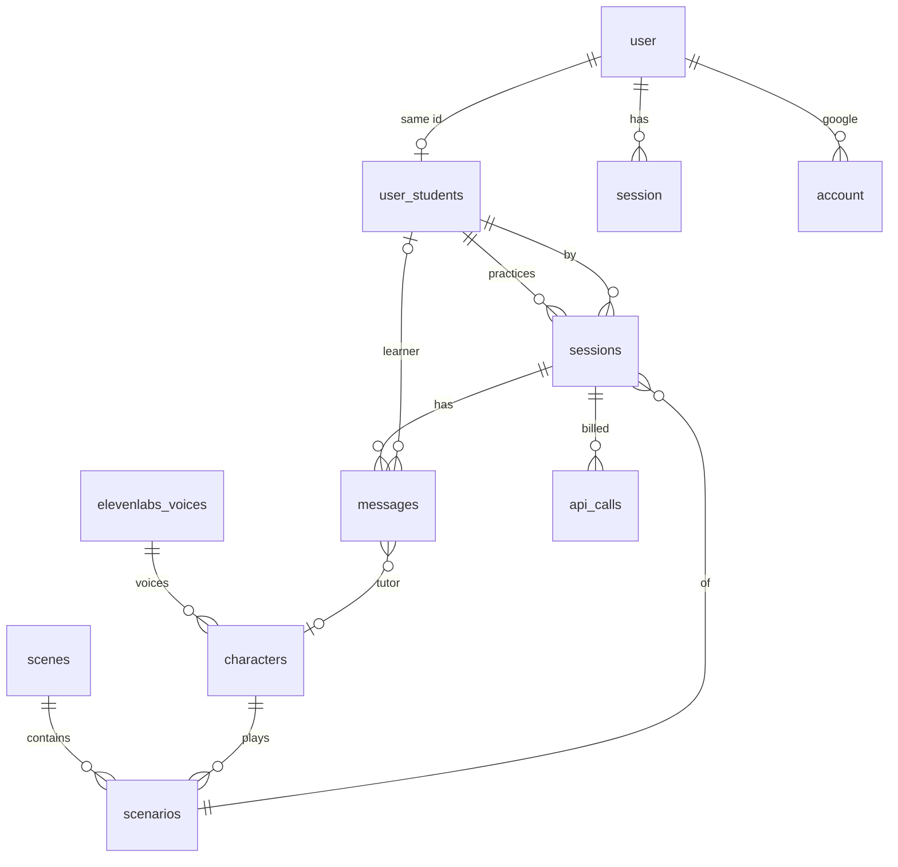

# Fluently — 資料層與 AI 串接

> 記錄 DB schema、Gemini 串接方式、API key 的流向，以及 token/來回次數是怎麼算出來的。
> 程式碼在 [`lib/db.ts`](../lib/db.ts)、[`lib/gemini.ts`](../lib/gemini.ts)、[`app/api/chat/route.ts`](../app/api/chat/route.ts)、[`lib/auth.ts`](../lib/auth.ts)。
> 改 schema 或改串接方式時，**同一個 commit 內更新這份文件**。

---

## 1. 資料庫（Cloudflare D1）

單一驅動：Cloudflare D1，藏在 [`lib/db.ts`](../lib/db.ts) 的 async adapter 後面。

| 環境 | 驅動 | 取得方式 |
|---|---|---|
| 正式 / `npm run preview`（Cloudflare Workers） | **D1** | `getCloudflareContext({ async: true }).env.DB` |
| `next dev` | **同一顆 local D1**（miniflare） | `initOpenNextCloudflareForDev()` 讓 `getCloudflareContext()` 在 Node 下也能拿到 `env.DB` |

`next.config.ts` 呼叫 `initOpenNextCloudflareForDev()`，所以 **dev 與正式共用同一條程式碼**，不再走 `node:sqlite`。本機資料在 `.wrangler/state/v3/d1/`，用 wrangler migrations 維護：

```bash
wrangler d1 migrations apply fluently_db --local   # 本機
wrangler d1 migrations apply fluently_db --remote  # 正式
```

D1 就是 SQLite，因此 `lib/db.ts` 每個匯出函式都回傳 `Promise`，呼叫端一律 `await`。

多使用者：登入走 **better-auth + Google**。帳號存在 `user` / `session` / `account` / `verification`（`migrations/0003_auth.sql`）。首次登入時 databaseHook 會用同一個 `user.id` 在 `user_students` 建一列學習者檔案。練習資料（`sessions` / `messages` / `api_calls` / `api_logs`）都以 `user_student_id = user.id` 隔離；沒登入不能進 `/scenarios`、`/chat`、`/usage`、`/logs`、`/tts`。

Auth 變數：本機 `next dev` 讀 `.env.local`；`npm run preview` 讀 `.dev.vars`（兩份都要有同一組）。正式環境用 `wrangler secret put` 設 `BETTER_AUTH_SECRET`、`GOOGLE_CLIENT_ID`、`GOOGLE_CLIENT_SECRET`。

### Schema

正式的權威來源是 `migrations/` 底下的 SQL。`--` 是欄位註記。

```sql
PRAGMA foreign_keys = ON;

-- 學習者檔案；id 等於 better-auth `user.id`，首次 Google 登入時由 databaseHook 建立
CREATE TABLE IF NOT EXISTS user_students (
  id         TEXT PRIMARY KEY, -- = user.id，不再 seed 'default'
  name       TEXT NOT NULL,    -- 顯示名稱（來自 Google 名稱）
  created_at INTEGER NOT NULL, -- 建立時間 epoch ms
  updated_at INTEGER NOT NULL  -- 最後更新 epoch ms
);

-- 場景：咖啡店 / 街頭 / 職場 / 酒吧 / 公園
CREATE TABLE IF NOT EXISTS scenes (
  id         TEXT PRIMARY KEY, -- 場景 id，例如 cafe、workplace
  title      TEXT NOT NULL,    -- 英文名，例如 Cafe
  title_zh   TEXT NOT NULL,    -- 中文名，例如 咖啡店
  emoji      TEXT NOT NULL,    -- 卡片圖示
  tint_light TEXT NOT NULL,    -- 淺色模式底色
  tint_dark  TEXT NOT NULL     -- 深色模式底色
);

-- ElevenLabs 音色庫；voice 一律讀這張表，不再讀 env
CREATE TABLE IF NOT EXISTS elevenlabs_voices (
  id       TEXT PRIMARY KEY, -- 內部 id，seed 預設 'bella'
  voice_id TEXT NOT NULL,    -- ElevenLabs 平台的 voice id
  label    TEXT NOT NULL,    -- 給人看的名稱，例如 Bella
  is_free  INTEGER NOT NULL DEFAULT 0 -- 1 = 免費方案可用；defaultVoiceId() 優先選這種
);

-- 系統裡的人物，例如 Bella
CREATE TABLE IF NOT EXISTS characters (
  id                  TEXT PRIMARY KEY, -- 人物 id，例如 bella
  name                TEXT NOT NULL,    -- 顯示名
  elevenlabs_voice_id TEXT NOT NULL REFERENCES elevenlabs_voices(id) -- 使用哪顆音色
);

-- 對話情境：點咖啡 / 面試…；id 即路由 /chat/[id]，公開後不可改
-- 角色以 role_type 欄位表示（不另立 roles 表，見文末「決策記錄」）
CREATE TABLE IF NOT EXISTS scenarios (
  id           TEXT PRIMARY KEY, -- 情境 id，例如 cafe
  scene_id     TEXT NOT NULL REFERENCES scenes(id),     -- 所屬場景
  character_id TEXT NOT NULL REFERENCES characters(id), -- 由哪個人物扮演（決定聲音）
  role_type    TEXT NOT NULL CHECK (role_type IN ('staff', 'friend', 'boss')), -- 工作人員/朋友/主管
  title        TEXT NOT NULL,    -- 英文情境名，例如 Ordering Coffee
  title_zh     TEXT NOT NULL,    -- 中文情境名，例如 咖啡廳點餐
  blurb        TEXT NOT NULL,    -- 一句話描述「你會遇到什麼」
  level        TEXT NOT NULL,    -- beginner / intermediate / advanced
  focus        TEXT NOT NULL,    -- 語言重點，JSON 陣列字串
  opening      TEXT NOT NULL,    -- 家教開場白（英文）
  persona      TEXT NOT NULL,    -- 英文人設，餵給 Gemini system instruction
  sort_order   INTEGER NOT NULL DEFAULT 0 -- 列表排序，數字越小越前
);

-- 一次練習對話
CREATE TABLE IF NOT EXISTS sessions (
  id               TEXT PRIMARY KEY, -- crypto.randomUUID()
  scenario_id      TEXT NOT NULL,    -- 對應 scenarios.id（程式關聯，schema 未加 FK）
  user_student_id  TEXT,             -- 哪位學習者；對應 user_students.id
  mode             TEXT NOT NULL DEFAULT 'script', -- script 獨白式 / live 真實情境
  created_at       INTEGER NOT NULL, -- 開始時間 epoch ms
  updated_at       INTEGER NOT NULL  -- 最後一則訊息時間 epoch ms
);

-- 對話記憶；每次呼叫 Gemini 會重送這段歷史
CREATE TABLE IF NOT EXISTS messages (
  id               INTEGER PRIMARY KEY AUTOINCREMENT,
  session_id       TEXT NOT NULL REFERENCES sessions(id) ON DELETE CASCADE, -- 所屬練習
  role             TEXT NOT NULL CHECK (role IN ('user', 'model')), -- user 學習者 / model 家教
  user_student_id  TEXT,             -- 學習者說話時有值
  character_id     TEXT,             -- 家教說話時有值
  content          TEXT NOT NULL,    -- 訊息正文
  created_at       INTEGER NOT NULL  -- epoch ms
);

-- 用量帳：一列 = 一次計費呼叫。情境/音色從 session 關聯推，不寫在這張表
CREATE TABLE IF NOT EXISTS api_calls (
  id             INTEGER PRIMARY KEY AUTOINCREMENT,
  session_id     TEXT NOT NULL REFERENCES sessions(id) ON DELETE CASCADE, -- 記在哪段練習
  kind           TEXT NOT NULL DEFAULT 'chat', -- chat 對話 / tts 語音；來回次數只數 chat
  model          TEXT NOT NULL,    -- 實際呼叫的模型 id
  prompt_tokens  INTEGER NOT NULL DEFAULT 0, -- Gemini promptTokenCount；TTS 常為 0
  output_tokens  INTEGER NOT NULL DEFAULT 0, -- candidatesTokenCount
  thought_tokens INTEGER NOT NULL DEFAULT 0, -- thoughtsTokenCount；思考模型才有
  total_tokens   INTEGER NOT NULL DEFAULT 0, -- totalTokenCount；不自己估算
  latency_ms     INTEGER NOT NULL DEFAULT 0, -- 這次呼叫耗時
  ok             INTEGER NOT NULL DEFAULT 1, -- 1 成功 / 0 失敗；失敗也要記
  error          TEXT,             -- 失敗時的錯誤訊息
  created_at     INTEGER NOT NULL  -- epoch ms
);

-- 原始呼叫紀錄（除錯）；寫入失敗不可拖垮請求，故 session 不加 FK
CREATE TABLE IF NOT EXISTS api_logs (
  id               INTEGER PRIMARY KEY AUTOINCREMENT,
  platform         TEXT NOT NULL,    -- gemini / elevenlabs
  endpoint         TEXT NOT NULL,    -- 完整 URL，不含 API key
  operation        TEXT NOT NULL,    -- chat / tts / verify-key
  model            TEXT,             -- 模型；verify-key 為 NULL
  detail           TEXT,             -- 額外參數，例如 voice=Kore
  session_id       TEXT,             -- 關聯練習，刻意不加外鍵
  user_student_id  TEXT,             -- 關聯學習者，可空、不加外鍵
  input            TEXT,             -- 送出內容；超過 4000 字截斷
  output           TEXT,             -- 收到內容；語音常記成 [audio] …
  input_tokens     INTEGER NOT NULL DEFAULT 0, -- 這次呼叫的輸入 token
  output_tokens    INTEGER NOT NULL DEFAULT 0, -- 輸出 token
  total_tokens     INTEGER NOT NULL DEFAULT 0, -- 總 token
  status           INTEGER NOT NULL DEFAULT 0, -- HTTP 狀態碼
  ok               INTEGER NOT NULL DEFAULT 0, -- 1 成功 / 0 失敗
  error            TEXT,             -- 錯誤文字
  requested_at     INTEGER NOT NULL, -- 送出時間 epoch ms
  returned_at      INTEGER NOT NULL, -- 收到時間 epoch ms
  duration_ms      INTEGER NOT NULL DEFAULT 0 -- 來回耗時
);

CREATE INDEX IF NOT EXISTS idx_messages_session ON messages(session_id, id);
CREATE INDEX IF NOT EXISTS idx_calls_session ON api_calls(session_id);
CREATE INDEX IF NOT EXISTS idx_calls_created ON api_calls(created_at);
CREATE INDEX IF NOT EXISTS idx_calls_kind ON api_calls(kind);
CREATE INDEX IF NOT EXISTS idx_logs_requested ON api_logs(requested_at);
CREATE INDEX IF NOT EXISTS idx_logs_operation ON api_logs(operation);
CREATE INDEX IF NOT EXISTS idx_scenarios_scene ON scenarios(scene_id);
CREATE INDEX IF NOT EXISTS idx_sessions_student ON sessions(user_student_id);
```

better-auth 的四張表（`migrations/0003_auth.sql`）：

```sql
CREATE TABLE IF NOT EXISTS "user" (
  "id"            TEXT NOT NULL PRIMARY KEY,
  "name"          TEXT NOT NULL,
  "email"         TEXT NOT NULL UNIQUE,
  "emailVerified" INTEGER NOT NULL,
  "image"         TEXT,
  "createdAt"     DATE NOT NULL,
  "updatedAt"     DATE NOT NULL
);

CREATE TABLE IF NOT EXISTS "session" (
  "id"        TEXT NOT NULL PRIMARY KEY,
  "expiresAt" DATE NOT NULL,
  "token"     TEXT NOT NULL UNIQUE,
  "createdAt" DATE NOT NULL,
  "updatedAt" DATE NOT NULL,
  "ipAddress" TEXT,
  "userAgent" TEXT,
  "userId"    TEXT NOT NULL REFERENCES "user" ("id")
);

CREATE TABLE IF NOT EXISTS "account" (
  "id"                    TEXT NOT NULL PRIMARY KEY,
  "accountId"             TEXT NOT NULL,
  "providerId"            TEXT NOT NULL,
  "userId"                TEXT NOT NULL REFERENCES "user" ("id"),
  "accessToken"           TEXT,
  "refreshToken"          TEXT,
  "idToken"               TEXT,
  "accessTokenExpiresAt"  DATE,
  "refreshTokenExpiresAt" DATE,
  "scope"                 TEXT,
  "password"              TEXT,
  "createdAt"             DATE NOT NULL,
  "updatedAt"             DATE NOT NULL
);

CREATE TABLE IF NOT EXISTS "verification" (
  "id"         TEXT NOT NULL PRIMARY KEY,
  "identifier" TEXT NOT NULL,
  "value"      TEXT NOT NULL,
  "expiresAt"  DATE NOT NULL,
  "createdAt"  DATE,
  "updatedAt"  DATE
);
```

### 遷移與種子

schema 與資料都走 wrangler migrations——

```bash
wrangler d1 migrations apply fluently_db --local   # 本機（next dev / preview）
wrangler d1 migrations apply fluently_db --remote  # 正式
```

| 檔案 | 作用 |
|---|---|
| `0001_init.sql` | 建表（含 `DROP TABLE IF EXISTS roles`） |
| `0001_schema_update.sql` | 給舊遠端 DB 補 `is_free` / `role_type` 等欄位 |
| `0002_seed.sql` | 場景、Bella 音色、8 個情境（**不**再種 `default` 學習者） |
| `0003_auth.sql` | better-auth 的 `user` / `session` / `account` / `verification` |
| `0004_user_link.sql` | 刪掉還存在的 seed `default` 學習者（沒有 sessions 才刪） |

列表與對話頁的 `getScenario()` / `listScenarios()` **讀 DB**，不再直接讀 TS 陣列。

### 表關係

`api_logs` 的 `session_id` / `user_student_id` 只是關聯用，**沒有外鍵**。
沒有 `roles` 表：角色類型是 `scenarios.role_type` 欄位；聲音經由
`scenario → character → voice` 推導。`user_students.id` 與 better-auth `user.id` 是同一個值。



`session`（better-auth 登入 cookie）與 `sessions`（一段練習對話）是兩張不同的表，不要搞混。

### 表的分工

| 表 | 回答的問題 |
|---|---|
| `user` / `session` / `account` / `verification` | 誰登入了（Google OAuth + cookie） |
| `user_students` | 學習者檔案（id = `user.id`） |
| `scenes` / `scenarios` / `characters` | 在哪、練什麼場面（含 `role_type` 演哪種角色）、由誰扮演 |
| `elevenlabs_voices` | 那個角色用哪顆 ElevenLabs 音色（`is_free` 標記免費方案可用） |
| `sessions` | 這段練習屬於誰、哪個情境 |
| `messages` | **記憶**——每次呼叫 Gemini 時整段歷史都從這裡撈出來重送 |
| `api_calls` | **用量帳**——一列 = 一次計費呼叫，`kind` 分對話與語音 |
| `api_logs` | **原始紀錄**——一列 = 一次對外呼叫，含送出/收到的實際內容與狀態碼 |

`messages` 與 `api_calls` 刻意分開：一次失敗的呼叫不會產生 AI 訊息，
但它**仍然是一次呼叫**，必須計入用量與錯誤率。

「來回次數」只數 `kind='chat'`——語音合成是附加成本，不是一次對話往返，
混在一起數會讓「練了幾輪」這個數字失真。

### `api_calls` 與 `api_logs` 的差別

兩張表刻意分開，不要合併：

| | `api_calls` | `api_logs` |
|---|---|---|
| 用途 | 用量統計與聚合 | 除錯與稽核 |
| 記錄什麼 | token 數、延遲、成敗 | 連同**實際送出與收到的文字**、HTTP 狀態碼、平台、端點 |
| 涵蓋範圍 | 對話與語音 | **所有**對外呼叫，含不花 token 的 `verify-key` |
| 外鍵 | 有（`session_id`） | **無**——記錄失敗絕不能拖垮請求 |

`/usage` 的「各情境用量」以 `api_calls JOIN sessions` 取 `scenario_id`，不再讀 `api_calls.scenario_id`。

`logApiCall()` 內部包了 try/catch，寫入失敗只會在 console 留一行錯誤，不會讓 API 呼叫失敗。

---

## 2. Token 與來回次數怎麼算

**不是估算的。** 數字直接取自 Gemini 回應的 `usageMetadata`
（[`lib/gemini.ts`](../lib/gemini.ts) 的 `generateReply`）：

| 顯示名稱 | 來源欄位 |
|---|---|
| 輸入 | `promptTokenCount` |
| 輸出 | `candidatesTokenCount` |
| 思考 | `thoughtsTokenCount` |
| 總計 | `totalTokenCount` |

**來回次數** = `api_calls` 中 `kind='chat'` 的列數。成功與失敗都算，因為兩者都送出了請求。
語音合成另外統計（`kind='tts'`），用量頁分成兩張卡。

注意 `promptTokenCount` 會隨對話變長而**持續增加**——每次呼叫都重送整段歷史。
這是自管記憶的必然代價，用量頁的「輸入 / 輸出」比例就是在觀察這件事。
`getHistory()` 預設只取最近 40 則來設上限。

聚合查詢都在 `lib/db.ts`：`getTotals`、`getUsageByScenario`、`getDailyUsage`、
`getRecentSessions`、`getRecentCalls`、`getSessionStats`。
觀察介面在 [`/usage`](../app/usage/page.tsx)。

---

## 3. Gemini 串接

**端點**：`POST https://generativelanguage.googleapis.com/v1beta/models/{model}:generateContent`
**認證**：`x-goog-api-key` 標頭
**預設模型**：`gemini-3.7-flash`（可用清單見 `MODELS`）

### 為什麼不用 Interactions API

Google 現在推薦新專案用 Interactions API，但它**把對話歷史存在 Google 那邊**
（`previous_interaction_id`），與本專案「用 SQLite 做記憶」的前提直接衝突。
`generateContent` 仍受完整支援，且我們自己管歷史，所以維持使用它。

### System instruction

由 `buildSystemInstruction(scenario)` 從情境資料組出來，用到
`persona`、`title`、`blurb`、`level`、`focus` 五個欄位（見 [SCENARIOS.md](SCENARIOS.md)）。
內容包含：角色設定、場景、依難度調整的語言複雜度、要引導的句型，
以及幾條硬規則（不出戲、只用英文、1–3 句加一個問題、純口語不要 markdown——
因為回覆會被語音合成唸出來）。

---

## 3.5 呼叫紀錄怎麼收集

`lib/gemini.ts` **會被 client 端 import**（`lib/settings.ts`、`components/settings-menu.tsx`
需要 `VOICES`、`DEFAULT_MODEL` 這些常數），所以**那個檔案裡絕對不能 import 資料庫**，
否則前端 build 會炸。

因此改用回呼：`generateReply` / `synthesizeSpeech` / `verifyKey` 都接受一個
`onCall?: ApiCallLogger`，在 fetch 回來後**不論成敗**都會帶著完整的 `ApiCallRecord` 觸發一次。
Route handler（server-only）再傳 `onCall: (call) => logApiCall({ ...call, sessionId })` 進去。

好處是紀錄發生在 **API 邊界**而不是各個呼叫端，所以不可能漏記——
包含那些不寫進 `api_calls` 的呼叫（例如驗證 key）。

`endpoint` 存的是完整 URL；因為認證走 `x-goog-api-key` 標頭而非 query string，
**key 不會出現在紀錄裡**。

### 檢視介面

[`/logs`](../app/logs/page.tsx) 是這張表的專屬頁面：依操作與狀態篩選、全文搜尋
（比對 `input` / `output` / `error` / `model`）、每頁 25 筆分頁，點任一列展開看完整送出與收到內容。

篩選與分頁**全部走 URL query（`?op=` / `?status=` / `?q=` / `?page=`）**，
展開用原生 `<details>`，所以整頁是純伺服器渲染，沒有任何 client JS。
`/usage` 只保留摘要與連往這裡的入口，不重複列表格。

## 4. API key 的流向

```
對話 / 語音
   → 優先用伺服器 GEMINI_API_KEY（.env.local / .dev.vars / Worker secret）
   → 沒有伺服器 key 才用設定面板寫進 localStorage、經 x-gemini-key 送來的那把
   → 轉成 x-goog-api-key 送給 Google
```

**key 不會寫進資料庫，也不會出現在任何 log。**
設定面板的 key 仍可驗證（`POST /api/key-check` 優先讀標頭）；`GET /api/key-check` 只回 `{ configured }`，表示伺服器有沒有備援 key。見 [`lib/gemini-key.ts`](../lib/gemini-key.ts)。

驗證用 [`/api/key-check`](../app/api/key-check/route.ts)，它呼叫 `GET /v1beta/models?pageSize=1`
——**不花任何 token** 就能確認 key 有效。

ElevenLabs 的 key **只存在** `.env.local` 的 `ELEVENLABS_API_KEY`（沒有 `NEXT_PUBLIC_` 前綴；
正式環境設在 Worker secret，本機 preview 放 `.dev.vars`）。
瀏覽器打 [`/api/elevenlabs`](../app/api/elevenlabs/route.ts)，由伺服器加上 `xi-api-key` 轉送給 ElevenLabs。
**音色一律讀 `elevenlabs_voices.voice_id`**：有 session 用 `resolveSessionVoiceId()`
（session → scenario → character → voice），沒有 session 用 `defaultVoiceId()`
（`ORDER BY is_free DESC` 取一筆，即 Bella）。env 的 `ELEVENLABS_VOICE_ID` 已不再參與選音。

對話頁（獨白式與真實情境）預設走這條 TTS：`speakReply()` 依設定打 `/api/elevenlabs`，
把家教回覆用角色音色唸出來，舞台畫面仍依 phase 切靜態圖。測試頁在 [`/tts`](../app/tts/page.tsx)。

有 `scenarioId` 時會建／續 session，並寫 `api_calls`（`kind='tts'`，token 為 0——ElevenLabs 不回 `usageMetadata`，不估算）以及 `api_logs`（`platform='elevenlabs'`）。
測試頁沒帶情境，只寫 `api_logs`，音色用 `defaultVoiceId()`（DB）。

---

## 5. 語音

### 學習者開口說（STT）

瀏覽器內建的 `SpeechRecognition` / `webkitSpeechRecognition`，`lang: en-US`，
**音訊不離開瀏覽器**。只有 Chromium 與 Safari 支援；不支援時介面會說明並退回打字。

### 家教的聲音（TTS）— 三種來源可切換

設定面板的「家教的聲音」有三個選項，**預設是角色（ElevenLabs）**：

| 來源 | 實作 | 成本 | 音質 |
|---|---|---|---|
| `elevenlabs`（預設） | `/api/elevenlabs` → `eleven_flash_v2_5` | ElevenLabs 額度 | 角色音色 |
| `gemini` | Gemini TTS 模型，走 `/api/speak` | 消耗音訊 token | 自然、可選音色 |
| `browser` | `speechSynthesis` | 免費 | 機械感 |

沒存過偏好時 `getVoiceSource()` 回 `elevenlabs`。雲端合成失敗會退回瀏覽器語音，對話不會突然安靜。

Voice Library 的音色在免費方案會回 402，畫面會說明原因並改用系統語音。角色音色一律存在 `elevenlabs_voices`（`is_free=1` 標記免費方案可用），env 不再參與選音。

**Gemini TTS 的呼叫方式**（[`synthesizeSpeech`](../lib/gemini.ts)）：

- 端點：`POST /v1beta/models/{ttsModel}:generateContent`
- 模型：`gemini-3.1-flash-tts-preview`（可用 `GEMINI_TTS_MODEL` 覆寫）
- 請求：`generationConfig.responseModalities: ["AUDIO"]` 加上
  `speechConfig.voiceConfig.prebuiltVoiceConfig.voiceName`
- 回應：`candidates[0].content.parts[0].inlineData.data` 是 base64 的**裸 PCM**
  （24 kHz、單聲道、16-bit）

**這裡同樣沒用 Interactions API**：它的 TTS token 回報方式官方文件沒寫清楚，
而 `generateContent` 這條路明確會回 `usageMetadata`——用量統計需要那個數字。

### PCM 要包成 WAV

瀏覽器不吃裸 PCM，所以伺服器用 `pcmToWav()` 在前面加 44 bytes 的 RIFF 標頭再回傳
`audio/wav`。取樣率從回應的 `mimeType`（形如 `audio/L16;codec=pcm;rate=24000`）解析，
解析不到就用 24000。

### 音色

30 個內建音色，清單與風格見 `VOICES`。預設 `Sulafat`（溫暖）。
送進來的音色名稱會用 `isKnownVoice()` 驗證，無效就退回預設。

### 自動出聲與瀏覽器的自動播放限制

進入對話頁時會**直接唸出開場白**（新房間一律先由家教開口，用來建立 `session`）。
之後每則回覆仍看 `自動朗讀家教回覆`（真實情境模式除外，它帶 `forceSpeak`）。
續接舊對話（`?session=`）刻意不自動播放——一進門就重播很久以前的句子只會讓人困惑。

開場 TTS 會在合成前建立 session，並用 `x-session-id` 回給瀏覽器；合成失敗則改放在 JSON 的 `sessionId`。
使用者若在開場音還在 loading 時就送出第一句，`send` 會等這顆 id 再到 `/api/chat`，避免兩邊各建一筆。
沒有 session 的新開場不走語音快取，否則伺服器不會被叫到、session 也建不起來。

瀏覽器在使用者尚未與該頁面互動前會擋掉播放，兩條路徑的表現不同，所以分開處理：

| 路徑 | 被擋時的徵狀 | 偵測方式 |
|---|---|---|
| Gemini（`Audio.play()`）／ElevenLabs | promise reject | `DOMException` 且 `name === "NotAllowedError"` |
| 瀏覽器（`speechSynthesis`） | **無聲失敗，不會拋錯** | 900ms 後檢查 `onstart` 沒觸發且 `speaking === false` |

被擋時畫面出現「🔊 點一下開啟聲音」，點一次之後同一個頁面就不會再被擋。
**自動播放被擋不算雲端 TTS 失敗**，所以不會觸發退回瀏覽器語音（那同樣會被擋）。

從情境卡片點進來屬於同一個 document 的互動，通常不會被擋；
直接貼網址或重新整理才比較容易遇到。

### 免持自動輪流（真實情境模式）

`components/live-room.tsx` 把既有零件串成一個輪流迴圈，**沒有自己做語音活動偵測**——
`listen()` 的 `continuous: false` 本來就會在講者停頓時自動結束並回傳 final transcript。

```
開場白播放 → (speakState 轉 idle) → 開麥聆聽
          → (拿到 final transcript) → 送出 → 等回覆
          → 回覆播放 → (idle) → 再開麥 → …
```

四個必須守住的邊界：

| 情況 | 處理 |
|---|---|
| **回音** | `stopListenRef` 有值就不重複開麥；接棒只發生在 `speakState` 轉 `idle` 之後，播放期間麥克風永遠是關的，否則會錄到家教自己的聲音而自問自答 |
| **靜音** | `onEnd` 但沒收到文字 → 400ms 後重開；連續 `SILENT_LIMIT`（3）次沒聽到就停下並顯示「點一下再試」，不無限重啟 |
| **權限被拒** | `onError === "not-allowed"` → 暫停迴圈並說明 |
| **離開頁面** | cleanup 同時 `abort()` 辨識與 `stopSpeaking()` |

`onSpeechFinished` 由 `useConversation` 在播放自然結束時觸發（手動停止不會觸發）。
真實情境模式帶 `forceSpeak: true`，**無視「自動朗讀」設定**——沒有聲音的沉浸模式沒有意義。

`recognition.start()` 包在 try/catch 裡：重複啟動會丟 `InvalidStateError`，
在會反覆自動呼叫的迴圈裡不接住就會整個炸掉。

### 快取與退回

- **快取**：用戶端以 `(音色, 文字)` 為鍵快取產生好的音檔 URL，
  所以「唸給我聽」重播同一句**不會再花 token**。
- **退回**：Gemini 合成失敗（沒額度、key 失效、網路斷）時，
  `speakReply()` 會自動改用瀏覽器語音並在畫面上說明原因，對話不會突然安靜。

## 6. 一次對話的完整流程

[`app/api/chat/route.ts`](../app/api/chat/route.ts)：

1. 取 key（標頭 → 環境變數），沒有就回 `401`
2. 驗證 `scenarioId` 與訊息內容
3. 沒有 `sessionId` → 建立 session，並**先寫入情境開場白**作為第一則 `model` 訊息。
   新房間通常已有開場 TTS 建好的 id，這一步只在瀏覽器語音（沒打 TTS API）時才會走到。
4. 寫入使用者訊息
5. `getHistory()` 撈整段歷史 → 呼叫 Gemini
6. 成功：寫入 AI 訊息 + 寫入 `api_calls`（`ok=1`）
7. 失敗：**仍然寫入 `api_calls`**（`ok=0` 加錯誤訊息），回傳錯誤

`/chat/[id]?session=<id>` 可以續接舊對話，用量頁的「最近的對話」就是連到這個。
`?mode=` 決定進哪一種介面（`script` / `live`）；兩者都走同一組 API 與資料表，
差別只在前端呈現。`sessions.mode` 記下這段對話是用哪個模式開始的。

[`app/api/speak/route.ts`](../app/api/speak/route.ts) 與 [`app/api/elevenlabs/route.ts`](../app/api/elevenlabs/route.ts) 是同樣的形狀：驗 key → 驗音色 →
（必要時建 session）→ 合成 → 寫 `api_calls`（`kind='tts'`）→ 回傳音訊。
成功時 session id 透過 `x-session-id` 標頭回給用戶端（body 是二進位音訊）；失敗時放在 JSON 的 `sessionId`，讓後續 `/api/chat` 沿用同一筆。

---

## 7. 已知限制

- **非串流**。用 `generateContent` 而非 `streamGenerateContent`，所以回覆是一次到位，
  等待期間顯示打字指示器。要改串流需同時改 route handler 與 `ChatRoom`。
- **沒有跨 session 記憶**。記憶目前只在單一 session 內。跨 session 的
  「他上次哪個句型講不順」還沒做——那需要另一張表存學習重點。
- **沒有成本估算**。只記 token 數，沒有換算成金額（不同模型費率不同）。
- **語音快取只在記憶體**。重新整理頁面後，同一句話會重新合成一次。
- **`api_logs` 會無限成長**，也**存了對話原文**。目前沒有自動清理或保留期限，
  需要的話得自己 `DELETE FROM api_logs WHERE requested_at < …`。
- **TTS 模型是 preview 版**。`gemini-3.1-flash-tts-preview` 隨時可能變動或改名。

---

## 8. 決策記錄（ADR）

### ADR-002：角色用欄位，不用表（`scenarios.role_type`）

- **日期**：2026-09-08
- **背景**：原本每個情境對應一列 `roles`（綁 `scenario_id`），存 `persona` 與 `character_id`。
  想把角色抽成可跨情境共用的分類（工作人員／朋友／主管）。
- **選項**：
  - A：把 `roles` 正規化成共用清單，情境改引用 `role_id`。
  - B：**移除 `roles` 表**，改用 `scenarios.role_type` 欄位（`staff`/`friend`/`boss`），
    `persona` 與 `character_id` 直接掛在 `scenarios`。
  - C：維持每情境一列的 `roles`。
- **決定**：**B**。
- **理由**：
  - `role_type` **既不顯示在 UI、也不進 Gemini prompt**（system instruction 只用
    `persona`/`title`/`blurb`/`level`/`focus`），所以獨立一張表是過度正規化。
  - 對 **token 完全沒有影響**——送給模型的內容與角色綁不綁表無關。
  - `persona` 本來就必須「每情境一份」（同樣是工作人員，咖啡店店員 ≠ 飯店櫃檯），
    留在 `scenarios` 最直接。
  - 需要「跨情境角色分類」時用一個欄位就夠；日後真要做角色層級設定，
    再升級成獨立表並補一次 migration 也不遲。

### ADR-003：Google 登入（better-auth）+ D1-only

- **日期**：2026-09-09
- **背景**：要把對話與用量綁到真實帳號，並在 Cloudflare Workers 上跑 OAuth。
- **決定**：
  - 只用 **Google** 登入（Facebook 的 App Review 成本太高，之後再加）。
- 用 **better-auth**（內建 D1 dialect，把 `env.DB` 直接當 `database`）+ session cookie 做 gating。
  - 為了讓 better-auth 在 `next dev` 拿到 D1 binding，`next.config.ts` 呼叫
    `initOpenNextCloudflareForDev()`。副作用是 **`node:sqlite` 退役**，dev/prod 都走 local/remote D1。
  - `user_students.id` = better-auth `user.id`；首次登入由 `databaseHooks.user.create.after` 建立。
  - Next 16 的路由保護寫在 [`proxy.ts`](../proxy.ts)（Next 16 取代了 `middleware.ts`）。
- **理由**：better-auth 對 D1/Workers 支援最好；延遲 `getAuth()` 避開「模組頂層拿不到 binding」的坑。

### ADR-001：資料層搬到 D1（保留 node:sqlite 供 dev）

- **日期**：2026-09-08（**已被 ADR-003 取代**：`node:sqlite` 已退役）
- **背景**：要部署到 Cloudflare，但 Workers runtime 沒有 `node:sqlite`、也沒有可寫檔案系統，
  DB 頁面會 500。
- **當時決定**：正式用 **Cloudflare D1**；`next dev` 仍用 `node:sqlite`。
- **現況**：見 ADR-003，dev 也走 miniflare D1。
